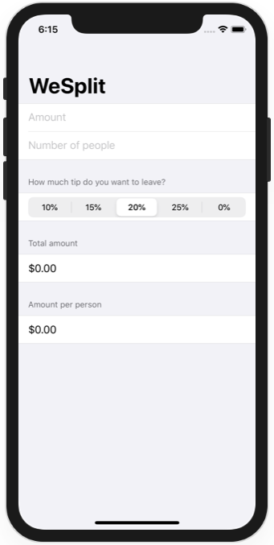
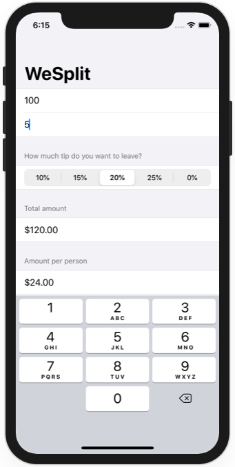

# Project 1 - WeSplit

https://www.hackingwithswift.com/100/swiftui/16

Includes solutions to the [challenges](https://www.hackingwithswift.com/books/ios-swiftui/wesplit-wrap-up).

## Topics

Form, Section, NavigationView, @State property wrapper, TextField, Picker, ForEach

## Challenges

From [Hacking with Swift](https://www.hackingwithswift.com/read/1/7/wrap-up):
>1. Add a header to the third section, saying “Amount per person”.
>2. Add another section showing the total amount for the check – i.e., the original amount plus tip value, without dividing by the number of people.
>3. Change the “Number of people” picker to be a text field, making sure to use the correct keyboard type.

## Screenshots

