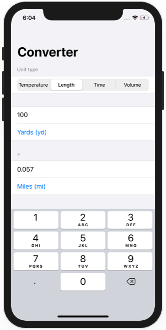
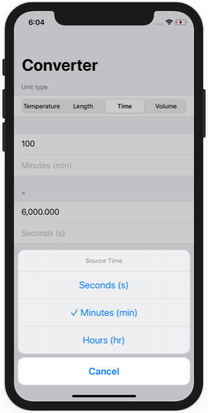

# Challenge Day 1 - Converter

https://www.hackingwithswift.com/100/swiftui/19

## Challenge

From [Hacking with Swift](https://www.hackingwithswift.com/100/swiftui/19):
>You need to build an app that handles unit conversions: users will select an input unit and an output unit, then enter a value, and see the output of the conversion.
>
>Which units you choose are down to you, but you could choose one of these:
>- Temperature conversion: users choose Celsius, Fahrenheit, or Kelvin.
>- Length conversion: users choose meters, kilometers, feet, yards, or miles.
>- Time conversion: users choose seconds, minutes, hours, or days.
>- Volume conversion: users choose milliliters, liters, cups, pints, or gallons.
>
>If you were going for length conversion you might have:
>- A segmented control for meters, kilometers, feet, yard, or miles, for the input unit.
>- A second segmented control for meters, kilometers, feet, yard, or miles, for the output unit.
>- A text field where users enter a number.
>- A text view showing the result of the conversion.
>
>So, if you chose meters for source unit and feet for output unit, then entered 10, you’d see 32.81 as the output.
>
>If you want a bigger challenge, try adding a third segmented control that lets us change the unit being converted – give your program the ability to convert temperature, length, time, or volume, all in one app.

## Screenshots

