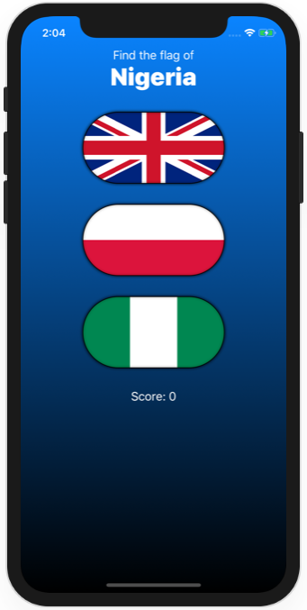

# Project 3 - Challenge 3

https://www.hackingwithswift.com/books/ios-swiftui/views-and-modifiers-wrap-up

## Challenges

From [Hacking with Swift](https://www.hackingwithswift.com/books/ios-swiftui/views-and-modifiers-wrap-up):
>Go back to project 2 and create a FlagImage() view that renders one flag image using the specific set of modifiers we had.

## Screenshots

