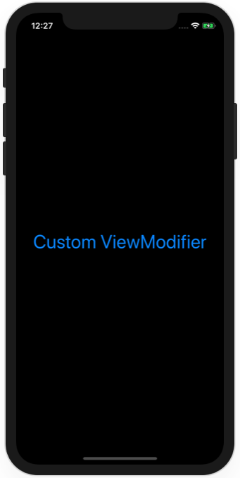

# Project 3 - Views and modifiers

https://www.hackingwithswift.com/100/swiftui/23

Includes solutions to the [challenges](https://www.hackingwithswift.com/books/ios-swiftui/views-and-modifiers-wrap-up).

## Topics

Views, modifiers, composition, containers

## Challenges

From [Hacking with Swift](https://www.hackingwithswift.com/books/ios-swiftui/views-and-modifiers-wrap-up):
>1. Create a custom ViewModifier (and accompanying View extension) that makes a view have a large, blue font suitable for prominent titles in a view.
>2. [Challenge 2](Challenge2/)
>3. [Challenge 3](Challenge3/)

## Screenshots

