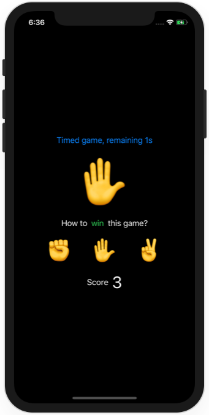

# Milestone Projects 1-3 - Rock Paper Scissors

https://www.hackingwithswift.com/100/swiftui/25

Bonus: timed mode

## Challenge

From [Hacking with Swift](https://www.hackingwithswift.com/guide/ios-swiftui/2/3/challenge):
>You have a basic understanding of arrays, state, views, images, text, and more, so let’s put them together: your challenge is to make a brain training game that challenges players to win or lose at rock, paper, scissors.
>
>So, very roughly:
>
>- Each turn of the game the app will randomly pick either rock, paper, or scissors.
>- Each turn the app will either prompt the player to win or lose.
>- The player must then tap the correct move to win or lose the game.
>- If they are correct they score a point; otherwise they lose a point.
>- The game ends after 10 questions, at which point their score is shown.
>- So, if the app chose “Rock” and “Win” the player would need to choose “Paper”, but if the app chose “Rock” and “Lose” the player would need to choose “Scissors”.
>
>To solve this challenge you’ll need to draw on skills you learned in tutorials 1 and 2:
>
>1. Start with a Single View App template, then create a property to store the three possible moves: ["Rock", "Paper", "Scissors"].
>2. You’ll need to create two @State properties to store the app’s current choice and whether the player should win or lose.
>3. You can use Int.random(in:) to select a random move. You can use it for whether the player should win too if you want, but there’s an even easier choice: Bool.random() is randomly true or false.
>4. Create a VStack showing the player’s score, the app’s move, and whether the player should win or lose. You can use if shouldWin to return one of two different text views.
>5. The important part is making three buttons that respond to the player’s move: Rock, Paper, or Scissors.

## Screenshots

