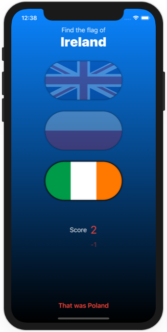

# Project 6 - Challenges

https://www.hackingwithswift.com/books/ios-swiftui/animation-wrap-up

## Challenges

From [Hacking with Swift](https://www.hackingwithswift.com/books/ios-swiftui/animation-wrap-up):
>1. When you tap the correct flag, make it spin around 360 degrees on the Y axis.
>2. Make the other two buttons fade out to 25% opacity.
>3. And if you tap on the wrong flag? Well, that’s down to you – get creative!

## Screenshots

