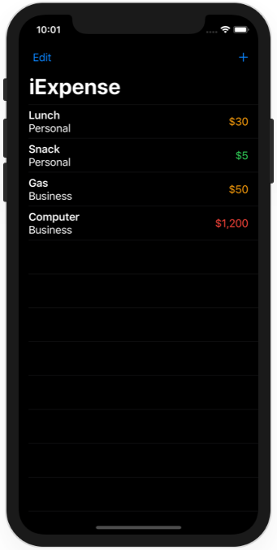
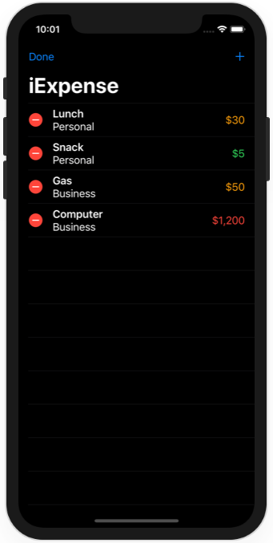

# Project 7 - iExpense

https://www.hackingwithswift.com/100/swiftui/36

Includes solutions to the [challenges](https://www.hackingwithswift.com/books/ios-swiftui/iexpense-wrap-up).

## Topics

UserDefaults, Codable, sheet(), onDelete(), @ObservedObject

## Challenges

From [Hacking with Swift](https://www.hackingwithswift.com/books/ios-swiftui/iexpense-wrap-up):
>1. Add an Edit/Done button to ContentView so users can delete rows more easily.
>2. Modify the expense amounts in ContentView to contain some styling depending on their value – expenses under $10 should have one style, expenses under $100 another, and expenses over $100 a third style. What those styles are depend on you.
>3. Add some validation to the Save button in AddView. If you enter “fish” or another thing that can’t be converted to an integer, show an alert telling users what the problem is.

## Screenshots

