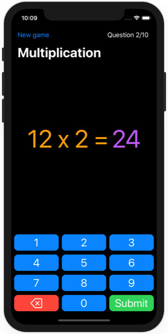
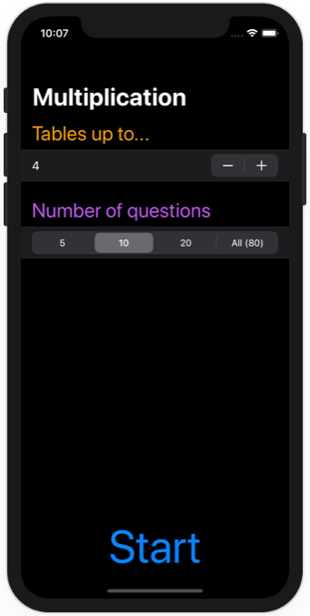

# Milestone Projects 4-6 - Multiplication Tables

https://www.hackingwithswift.com/100/swiftui/35

## Challenge

From [Hacking with Swift](https://www.hackingwithswift.com/guide/ios-swiftui/3/3/challenge):
>Your goal is to build an “edutainment” app for kids to help them practice multiplication tables – “what is 7 x 8?” and so on. Edutainment apps are educational at their code, but ideally have enough playfulness about them to make kids want to play.
>
>Breaking it down:
>
>- The player needs to select which multiplication tables they want to practice. This could be pressing buttons, or it could be an “Up to…” stepper, going from 1 to 12.
>- The player should be able to select how many questions they want to be asked: 5, 10, 20, or “All”.
>- You should randomly generate as many questions as they asked for, within the difficulty range they asked for. For the “all” case you should generate all possible combinations.
>
>If you want to go fully down the “education” route then this is going to be some steppers, a text field and a couple of buttons. I would suggest that’s a good place to start, just to make sure you have the basics covered.
>
>Once you have that, it’s down to you how far you want to take the app down the “entertainment” route – you could throw away fixed controls like Stepper entirely if you wanted, and instead rely on colorful buttons to get the same result. You could use something like Kenney’s Animal Pack (which is public domain, by the way!) to add a fun theme to make it into a real game. And hopefully you will also add some over the top animations – it needs to appeal to kids 9 and under, so going bright, colorful, and perhaps even a bit zany is a good idea!

## Screenshots

