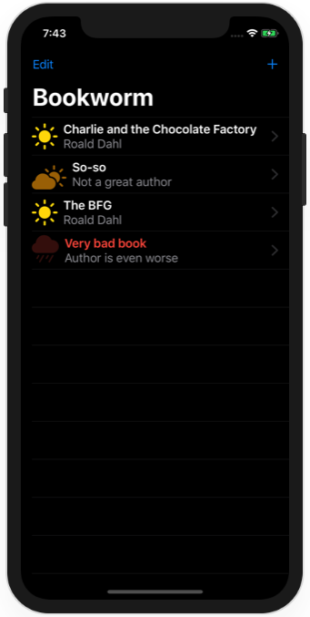

# Project 11 - Bookworm

https://www.hackingwithswift.com/100/swiftui/53

Includes solutions to the [challenges](https://www.hackingwithswift.com/books/ios-swiftui/bookworm-wrap-up).

# Credits

Pictures by Ryan Wallace, Eugene Triguba, Jamie Street, Alvaro Serrano, Joao Silas, David Dilbert, Casey Horner, and Katie Drazdauskaite on [Unsplash](https://unsplash.com/).

## Topics

Core Data, @Binding, Custom components

## Challenges

From [Hacking with Swift](https://www.hackingwithswift.com/books/ios-swiftui/cupcake-corner-wrap-up):
>1. Right now it’s possible to select no genre for books, which causes a problem for the detail view. Please fix this, either by forcing a default, validating the form, or showing a default picture for unknown genres – you can choose.
>2. Modify ContentView so that books rated as 1 star have their name shown in red.
>3. Add a new “date” attribute to the Book entity, assigning Date() to it so it gets the current date and time, then format that nicely somewhere in DetailView.

## Screenshots

