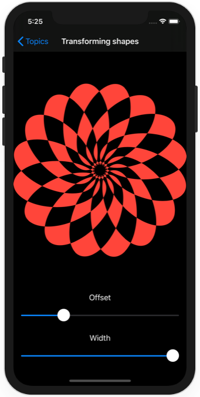
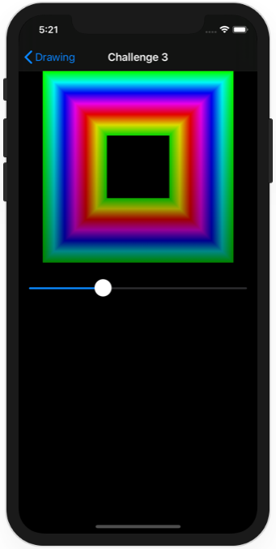

# Project 9 - Drawing

https://www.hackingwithswift.com/100/swiftui/43

Includes solutions to the [challenges](https://www.hackingwithswift.com/books/ios-swiftui/drawing-wrap-up).

## Topics

Paths, shapes, strokes, transforms, drawing groups, animating values, Core Animation, Metal

## Challenges

From [Hacking with Swift](https://www.hackingwithswift.com/books/ios-swiftui/drawing-wrap-up):
>1. Add the launch date to MissionView, below the mission badge.
>2. Modify AstronautView to show all the missions this astronaut flew on.
>3. Make a bar button in ContentView that toggles between showing launch dates and showing crew names.

## Screenshots

