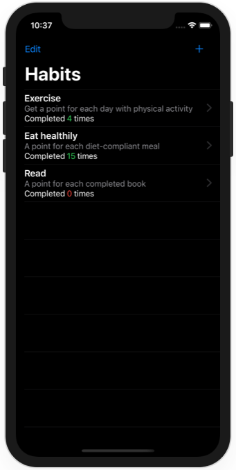

# Milestone Projects 7-9 - Habits Tracker

https://www.hackingwithswift.com/100/swiftui/47

## Challenge

From [Hacking with Swift](https://www.hackingwithswift.com/guide/ios-swiftui/4/3/challenge):
>This time your goal is to build a habit-tracking app, for folks who want to keep track of how much they do certain things. That might be learning a language, practicing an instrument, exercising, or whatever – they get to decide which activities they add, and track it however they want.
>
>At the very least, this means there should be a list of all activities they want to track, plus a form to add new activities – a title and description should be enough.
>
>For a bigger challenge, tapping one of the activities should show a detail screen with the description, how many times they have completed it, plus a button incrementing their completion count.
>
>For an even bigger challenge, use Codable and UserDefaults to load and save all your data.
>
>So, there are three levels to this app, and you can choose how far you want to go depending on how much time you have and how far you want to push yourself. I do recommend you at least give each level a try, though – every little bit of practice you get helps solidify your learning!

## Screenshots

