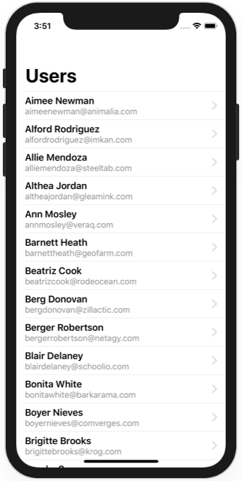
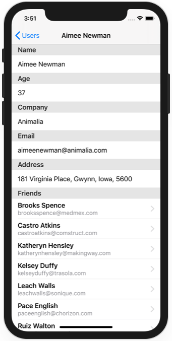

# Milestone Projects 10-12 - Users listing

https://www.hackingwithswift.com/100/swiftui/60 and https://www.hackingwithswift.com/100/swiftui/61

This milestone project is in 2 parts:
- Part1 fetches online JSON data on every app launch
- Part2 fetches online JSON data on the first launch, and caches it with Core Data for further launches.

## Challenges

#### 1. JSON / URLSession

From [Hacking with Swift](https://www.hackingwithswift.com/guide/ios-swiftui/5/3/challenge):
>It’s time for you to build an app from scratch, and it’s a particularly expansive challenge today: your job is to use URLSession to download some JSON from the internet, use Codable to convert it to Swift types, then use NavigationView, List, and more to display it to the user.
>
>Your first step should be to examine the JSON. The URL you want to use is this: https://www.hackingwithswift.com/samples/friendface.json – that’s a massive collection of randomly generated data for example users.
>
>As you can see, there is an array of people, and each person has an ID, name, age, email address, and more. They also have an array of tag strings, and an array of friends, where each friend has a name and ID.
>
>How far you implement this is down to you, but at the very least you should:
>
>Fetch the data and parse it into User and Friend structs.
Display a list of users with a little information about them.
Create a detail view shown when a user is tapped, presenting more information about them.
Where things get more interesting is with their friends: if you really want to push your skills, think about how to show each user’s friends on the detail screen.
>
>For a medium-sized challenge, show a little information about their friends right on the detail screen. For a bigger challenge, make each of those friends tappable to show their own detail view.

#### 2. Core Data

From [Hacking with Swift](https://www.hackingwithswift.com/100/swiftui/61):
>Yes, your job today is to expand your app so that it uses Core Data. Your boss just emailed you to say the app is great, but once the JSON has been fetched they really want it to work offline. This means you need to use Core Data to store the information you download, then use your Core Data entities to display the views you designed – you should only need to fetch the data once.

## Screenshots

