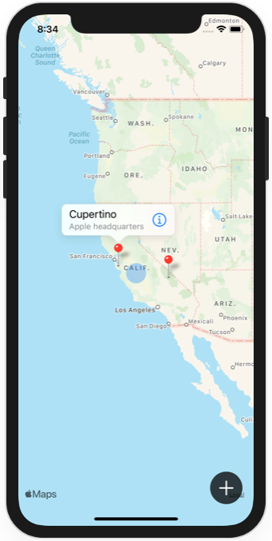

# Project 14 - Bucket List

https://www.hackingwithswift.com/100/swiftui/68

Includes solutions to the [challenges](https://www.hackingwithswift.com/books/ios-swiftui/bucket-list-wrap-up).

## Topics

MapKit, Biometric authentication, Secure data writing, Comparable custom types, Documents directory

## Challenges

From [Hacking with Swift](https://www.hackingwithswift.com/books/ios-swiftui/bucket-list-wrap-up):

>1. Our + button is rather hard to tap. Try moving all its modifiers to the image inside the button – what difference does it make, and can you think why?
>2. Having a complex if condition in the middle of ContentView isn’t easy to read – can you rewrite it so that the MapView, Circle, and Button are part of their own view? This might take more work than you think!
>3. Our app silently fails when errors occur during biometric authentication. Add code to show those errors in an alert, but be careful: you can only add one alert() modifier to each view.

Additional challenges, from [Hacking with Swift](https://www.hackingwithswift.com/books/ios-swiftui/writing-data-to-the-documents-directory):

>Before we move on, here’s a small challenge for you: back in project 8 we looked at how to create a generic extension on Bundle that let us find, load, and decode any Codable data from our app bundle. Can you write something similar for the documents directory, perhaps making it an extension on FileManager?

## Screenshots

