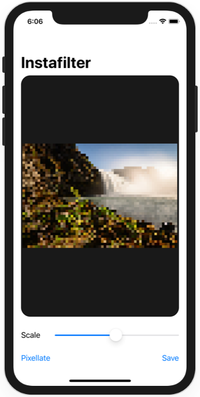

# Project 13 - Instafilter

https://www.hackingwithswift.com/100/swiftui/62

Includes solutions to the [challenges](https://www.hackingwithswift.com/books/ios-swiftui/instafilter-wrap-up).

## Topics

UIKit integration, Core Image, Custom bindings, Action Sheets

## Challenges

From [Hacking with Swift](https://www.hackingwithswift.com/books/ios-swiftui/instafilter-wrap-up):

>1. Try making the Save button show an error if there was no image in the image view.
>2. Make the Change Filter button change its title to show the name of the currently selected filter.
>3. Experiment with having more than one slider, to control each of the input keys you care about. For example, you might have one for radius and one for intensity.

## Screenshots

