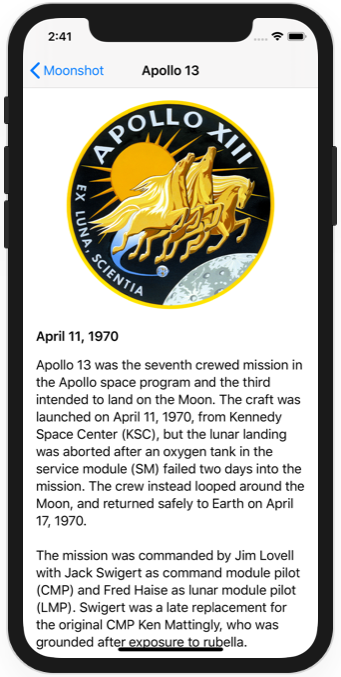
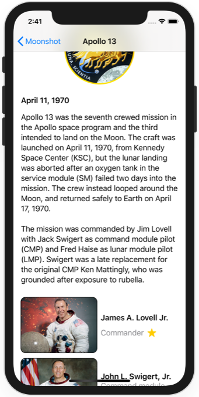

# Project 18 - Challenge 1

https://www.hackingwithswift.com/books/ios-swiftui/layout-and-geometry-wrap-up

## Challenges

From [Hacking with Swift](https://www.hackingwithswift.com/books/ios-swiftui/layout-and-geometry-wrap-up):
>Change project 8 (Moonshot) so that when you scroll down in MissionView the mission badge image gets smaller. It doesn’t need to shrink away to nothing – going down to maybe 80% is fine.

## Screenshots

