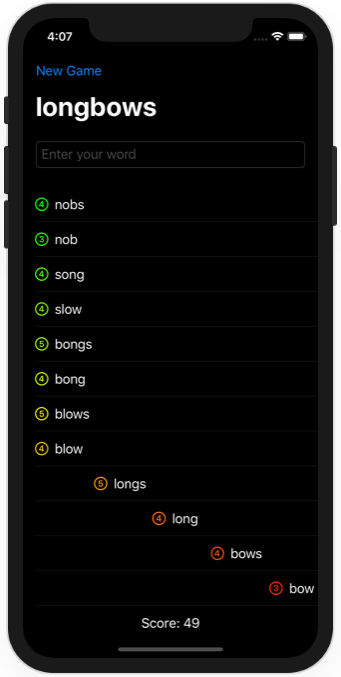

# Project 18 - Challenge 3

https://www.hackingwithswift.com/books/ios-swiftui/layout-and-geometry-wrap-up

## Challenges

From [Hacking with Swift](https://www.hackingwithswift.com/books/ios-swiftui/layout-and-geometry-wrap-up):
>For a real challenge make the letter count images in project 5 change color as you scroll. For the best effect, you should create colors using the Color(red:green:blue:) initializer, feeding in values for whichever of red, green, and blue you want to modify. The values to input can be figured out using the row’s current position divided by maximum position, which should give you values in the range 0 to 1.

## Screenshots

