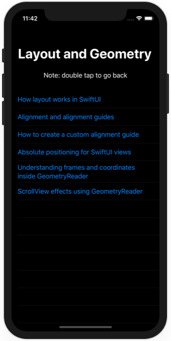
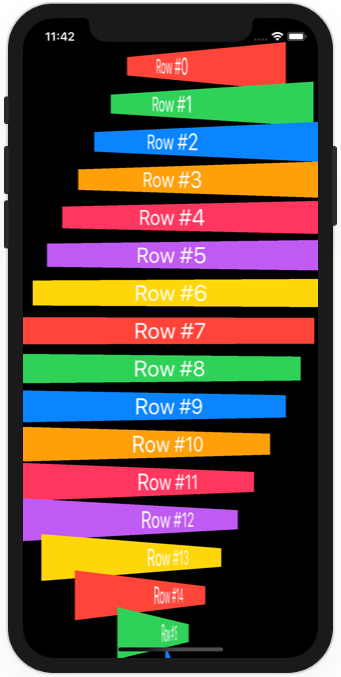
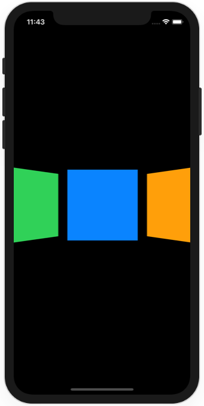

# Project 18 - Layout and Geometry

https://www.hackingwithswift.com/100/swiftui/92

Includes solutions to the [challenges](https://www.hackingwithswift.com/books/ios-swiftui/layout-and-geometry-wrap-up).

## Topics

Layout, alignment, geometry, positioning

## Challenges

1. [Challenge 1](Challenge1/)
2. [Challenge 2](Challenge2/)
3. [Challenge 3](Challenge3/)

## Screenshots

