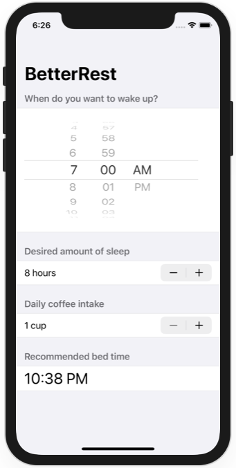

# Project 15 - Challenge 2

https://www.hackingwithswift.com/books/ios-swiftui/accessibility-wrap-up

## Challenges

From [Hacking with Swift](https://www.hackingwithswift.com/books/ios-swiftui/accessibility-wrap-up):
>Fix the steppers in BetterRest so that they read out useful information when the user adjusts their values.

## Screenshots

