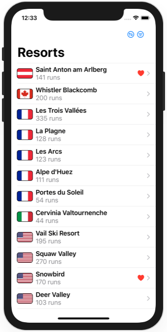
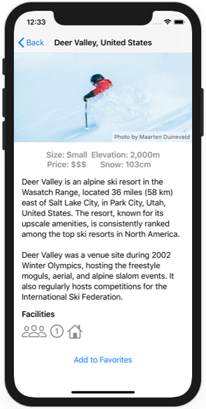
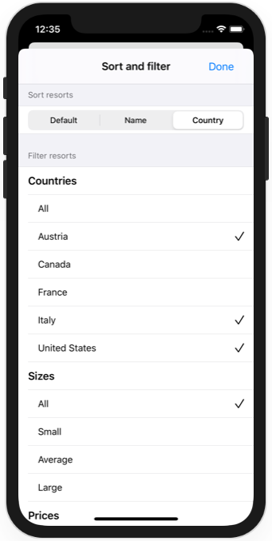

# Project 19 - SnowSeeker

https://www.hackingwithswift.com/100/swiftui/96

Includes solutions to the [challenges](https://www.hackingwithswift.com/books/ios-swiftui/snowseeker-wrap-up).

## Topics

Split view layouts, optional alerts, flexible layouts with Group, ListFormatter

## Challenges

From [Hacking with Swift](https://www.hackingwithswift.com/books/ios-swiftui/snowseeker-wrap-up):

>1. Add a photo credit over the ResortView image. The data is already loaded from the JSON for this purpose, so you just need to make it look good in the UI.
>2. Fill in the loading and saving methods for Favorites.
>3. For a real challenge, let the user sort and filter the resorts in ContentView. For sorting use default, alphabetical, and country, and for filtering let them select country, size, or price.

## Screenshots

