# 100-days-of-swiftui

Solutions to Paul Hudson's "100 days of SwiftUI" projects and challenges.

https://www.hackingwithswift.com/100/swiftui

## Preview

*Within each project are larger versions of the screenshots.*

Projects / Topics                                                                                                                                                            | Screenshots
---                                                                                                                                                                          |---
[Project 1](01-Project1) - *WeSplit*  (with challenges)                                           Form, Section, NavigationView, @State property wrapper, TextField, Picker, ForEach  |   |
[Challenge Day 1](02-ChallengeDay1) - *Converter*  |   |
[Project 2](03-Project2) - *Guess the Flag*  (with challenges)                                           VStack, Image, Alert  |   |
[Project 3](04-Project3) - *View and Modifiers*  (with challenge 1)                                           Views, modifiers, composition, containers  |  |
[Project 3 - Challenge 2](05-Project3-Challenge2)  (base: project 1)                                                          | 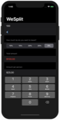 |
[Project 3 - Challenge 3](06-Project3-Challenge3)  (base: project 2)                                                          |  |
[Milestone Projects 1-3](07-Milestone-Projects1-3) - *Rock Paper Scissors*  |  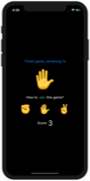 |
[Project 4](08-Project4) - *BetterRest*  (with challenges)                                           Machine Learning, Dates (DatePicker, DateComponents, DateFormatter) Stepper, navigationBarItems()  | 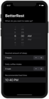 |
[Project 5](09-Project5) - *Word Scramble*  (with challenges)                                           List, onAppear, Bundle, fatalError(), UITextChecker  | 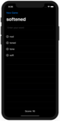 |
[Project 6](10-Project6) - *Animations*                                           Animations and transitions  |  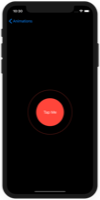  |
[Project 6 - Challenges](11-Project6-Challenges)  (base: project 2)                                                          | 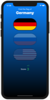  |
[Milestone Projects 4-6](12-Milestone-Projects4-6) - *Multiplication Tables*  | 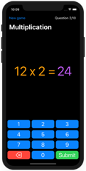  |
[Project 7](13-Project7) - *iExpense*  (with challenges)                                           UserDefaults, Codable, sheet(), onDelete(), @ObservedObject  | 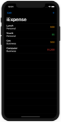 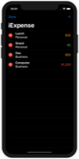 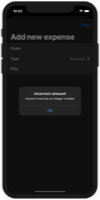 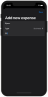 |
[Project 8](14-Project8) - *Moonshot*  (with challenges)                                           GeometryReader, ScrollView, Navigation, Codable hierarchy, Generics  | 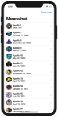  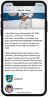 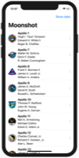 |
[Project 9](15-Project9) - *Drawing*  (with challenges)                                           Paths, shapes, strokes, transforms, drawing groups, animating values, Core Animation, Metal  | 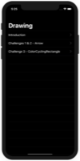  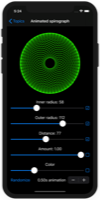 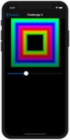 |
[Milestone Projects 7-9](16-Milestone-Projects7-9) - *Habit Tracker*  |  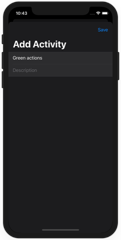  |
[Project 10](17-Project10) - *Cupcakes Corner*  (with challenges)                                           Codable, URLSession, disabled()  | 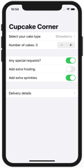  |
[Project 11](18-Project11) - *Bookworm*  (with challenges)                                           Core Data, @Binding, Custom components  |  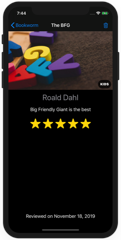 |
[Project 12](19-Project12) - *Core Data*  (with challenges)                                           Core Data  | 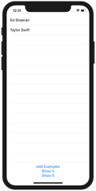 |
[Milestone Projects 10-12](20-Milestone-Projects10-12) - *Users listing*  |    |
[Project 13](21-Project13) - *Instafilter*  (with challenges)                                           UIKit integration, Core Image, Custom bindings, Action Sheets  |  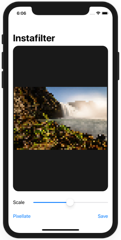 |
